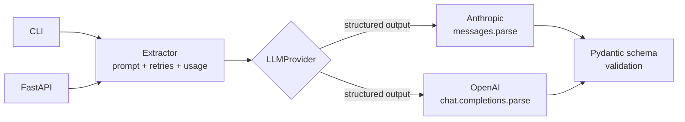

<div align="center">

# 🧲 structured-extractor

**Turn messy, unstructured text into validated, typed data — with any LLM.**

Provider-agnostic structured extraction (Anthropic + OpenAI) using schema-constrained
output, with retries, cost accounting, a CLI, and a FastAPI service.

</div>

---

## ⚡ Quick Start

```bash
git clone https://github.com/Arunops700/structured-extractor.git && cd structured-extractor
uv sync --extra dev          # installs everything — no API keys needed
uv run extract schemas       # list the built-in extraction schemas
```
*Runs offline.* Add `ANTHROPIC_API_KEY` or `OPENAI_API_KEY` to a local `.env` to extract for real.

---

## Problem

LLMs are great at reading messy text — invoices, emails, support tickets — but applications
need **structured, validated data**, not prose. Asking a model to "reply in JSON" is brittle:
it hallucinates fields, breaks on edge cases, and silently drifts. This project does it the
production way: **schema-constrained generation** (the provider enforces the shape) +
**Pydantic validation** (you enforce the semantics) + **bounded retries** + **cost logging** —
behind one interface that works across providers.

## What it does

Give it text and a Pydantic schema; get back a validated instance of that schema.

```bash
extract run --schema contact "Hi, I'm Dr. Ada Lovelace, reach me at ada@analytical.io — I lead R&D at Babbage Inc."
```
```json
{
  "name": "Ada Lovelace",
  "email": "ada@analytical.io",
  "phone": null,
  "company": "Babbage Inc.",
  "title": "Head of R&D"
}
```
```
[anthropic/claude-opus-4-8] 184 tokens (~$0.0017), 1 attempt(s)
```

## Architecture



The whole app depends only on the narrow `LLMProvider` protocol. Providers do exactly one
thing — one schema-constrained call — while the `Extractor` owns prompt construction,
retries, and cost accounting. Swapping or adding a provider touches nothing else
(Dependency Inversion in practice). Full reasoning in [`docs/architecture.md`](docs/architecture.md).

## Tech stack

`Python 3.12` · `Pydantic v2` · `Anthropic SDK` · `OpenAI SDK` · `FastAPI` · `Typer` ·
`uv` · `ruff` · `mypy` · `pytest` · `Docker` · `GitHub Actions`

## Setup

```bash
git clone https://github.com/Arunops700/structured-extractor.git
cd structured-extractor
uv sync --extra dev          # create the env and install deps
cp .env.example .env         # then add your API key(s)
```

### Configuration (`.env`)

| Variable | Purpose | Default |
|---|---|---|
| `PROVIDER` | `anthropic` or `openai` | `anthropic` |
| `ANTHROPIC_API_KEY` / `OPENAI_API_KEY` | credentials | — |
| `ANTHROPIC_MODEL` | model id | `claude-opus-4-8` |
| `OPENAI_MODEL` | model id | `gpt-4o` |
| `MAX_TOKENS` | output cap | `4096` |
| `MAX_RETRIES` | retry attempts on failure | `2` |

> **Cost note:** the Anthropic default is Opus 4.8 (per Anthropic's guidance). For
> high-volume, cost-sensitive extraction, set `ANTHROPIC_MODEL=claude-haiku-4-5` — extraction
> is an easy task and Haiku is ~5× cheaper. See [`docs/architecture.md`](docs/architecture.md).

## Usage

**CLI**
```bash
extract schemas                              # list built-in schemas
extract run --schema invoice --file inv.txt  # extract from a file
echo "great product, shipped late" | extract run --schema feedback   # or stdin
extract run --schema contact --provider openai "..."                 # override provider
```

**API**
```bash
uv run uvicorn structured_extractor.api:app --reload
# POST /extract  {"text": "...", "schema_name": "contact"}
# GET  /schemas  GET /health
```

**Library**
```python
from structured_extractor import Extractor
from structured_extractor.factory import build_provider
from structured_extractor.config import load_settings
from structured_extractor.schemas import Invoice

extractor = Extractor(build_provider(load_settings()))
result = extractor.extract(open("invoice.txt").read(), Invoice)
print(result.data, result.usage.estimated_cost_usd)
```

Bring your own schema — any `pydantic.BaseModel` works; the registry just wires names for the CLI/API.

## How it works (the reliable part)

1. **Schema-constrained generation.** Anthropic's `messages.parse` and OpenAI's
   `chat.completions.parse` constrain the model to your JSON schema and return a *validated*
   object — not free text you have to `json.loads` and pray over.
2. **No sampling foot-guns.** On Claude Opus 4.8 sampling params (`temperature`) are removed
   and would 400; the Anthropic provider omits them. The OpenAI provider sets `temperature=0`.
   Same goal (determinism), provider-correct implementation, hidden behind one interface.
3. **Bounded retries.** Transient provider errors and the rare invalid output get one or two
   more attempts, then a clear, typed exception.
4. **Cost accounting.** Every result carries token counts and an estimated USD cost.

## Testing

```bash
uv run ruff check . && uv run mypy . && uv run pytest
```
Tests use hand-written fake providers (`tests/conftest.py`) — **no API keys or network needed** —
because every backend implements the same protocol. CI runs lint + type-check + tests on every push.

## Deployment

```bash
docker build -t structured-extractor .
docker run -p 8000:8000 --env-file .env structured-extractor
```

## Future improvements

- Streaming + batch extraction for large corpora
- A reranking/confidence score per field
- Observability hooks (tracing, structured logs) — picked up in a later milestone
- PDF/image ingestion (OCR) before extraction

## Learn more

- [`docs/architecture.md`](docs/architecture.md) — design decisions and trade-offs
- [`docs/interview-questions.md`](docs/interview-questions.md) — Q&A this project answers
- [`docs/lessons-learned.md`](docs/lessons-learned.md) — what building it taught

## License

[MIT](LICENSE) · Part of my [AI_Engineer](https://github.com/Arunops700/AI_Engineer) portfolio (Milestone 1).
